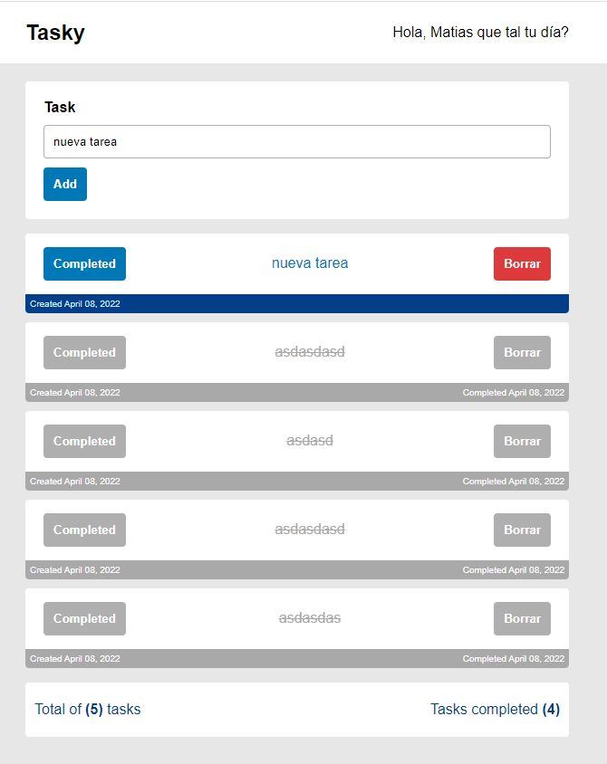

# Task App con ReactJS desde 0

Aplicación sencilla para practicar reactjs, esta aplicación se esta creando en vivo, sin ninguna preparación solo estoy colocando todo lo que se, además, voy explicando cada cosa que hago en el código para que las personas puedan aprender y complementar algo a lo que ya saben sobre el desarrollo frontend en general.

## Screenshot

## Cosas por hacer

- [x] Setup del proyecto
  - [x] Instalación de Vite.js
  - [x] Limpieza del proyecto inicial
  - [x] Configuración de Eslint
  - [x] Configuración de Prettier
  - [x] Instalación de JSON Server
  - [x] Crear repositorio en GIT
  - [] Crear variables de entorno
- [x] Creación de Componentes
  - [x] Task components
  - [x] Estilos para tasks
- [x] Funcionalidad del Proyecto
  - [x] Listar Tasks
  - [x] Agregar Task
  - [x] Eliminar Task
  - [x] Actualizar estado de las Tasks
  - [x] Formatear fechas de las Tasks
  - [x] Agregar PropTypes para Tipar
  - [x] Compount Components para nuestro Task
  - [x] Mostrar total de Tasks
  - [x] Mostrar total de Tasks completadas
  - [x] Usar Context API global (cualquier ejemplo)
- [] Deployar el proyecto

## Tecnologías utilizadas

- ReactJS version `17.0.2`
- PropTypes version `15.8.1`
- JSON Server version `0.17.0`
- Vite version `2.8.0`
- Prettier version `2.6.0`
- Eslint version `7.32.0`

## Uso

Puedes hacer fork a este repositorio y luego descargar el proyecto. Instalar las dependencias utilizando `npm install`.
Luego para correr el proyecto `npm run dev` y para correr el servidor sería `npm run server`, asegurte de tener los puertos 3000 y 30001 disponibles. De lo contrario asegurate de cambiarlos en el package.json.
Puedes hacer checking de tu código con el comando `npm run lint-check`, si quieres corregirlos automaticamente puedes utilizar `npm run lint` y por útlimo para formatear el código puedes utilizar `npm run lint-check`.

## Mejoras a Futuro

A pesar de que es un proyecto que voy mejorando a medida de que se me vayan ocurriendo cosas, tengo pensado:

- Autenticación.
- Útilizar un SaaS como Stripe o Firebase como backend.
- Agregar Testing a nuestra aplicación.
- Dark Mode.

Acepto cualquier sugerencía sobre que debería agregar o mejorar de este proyecto.

## Como me puedes ayudar?

Este proyecto lo hago para poner en practica mis conocimientos sobre React mienstras le explico e incluso puedo llegar a enseñar a alguien que este en su camino como desarrollador, no te pido nada en particular, solo si te gusta el contenido compartelo con tus amigos o cualquier persona que creas que le pueda servir.

## Se parte de mi comunidad

Puedes seguirme en cualquiera de mis redes sociales para que estes al tanto de todo lo que suba.

- 🕊 [Twitter.com](https://twitter.com/cristhianjhlweb)
- 📘 [LinkedIn.com](https://www.linkedin.com/in/cristhianjhl/)
- 🦝 [GitHub.com](https://github.com/cristhianjhlweb)
- 📹 [YouTube.com](https://www.youtube.com/channel/UCHAghHz0ytlb7OthFRJRg7Q)
- 🌐 [Cristhianjhl.com](https://cristhianjhl.com?utm_source=github&utm_medium=referrer&utm_campaign=task_app_reactjs)

Hice este proyecto en vivo transmitiendo por 📺 [Twitch.tv](https://twitch.tv/cristhianjhlweb)
